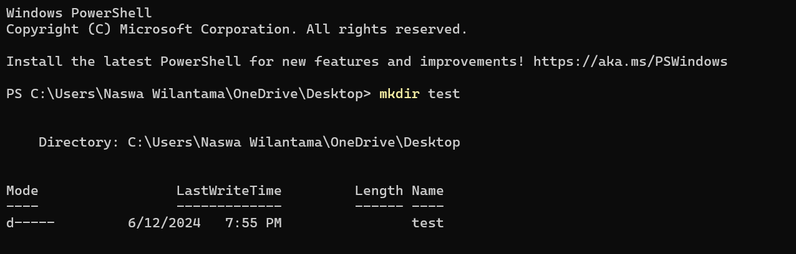
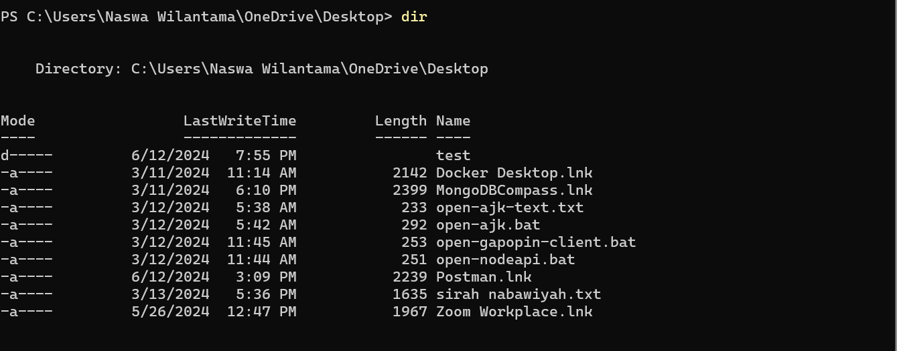
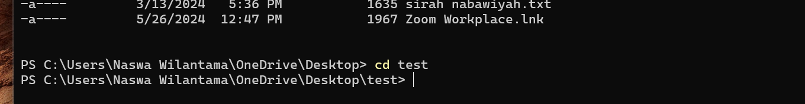
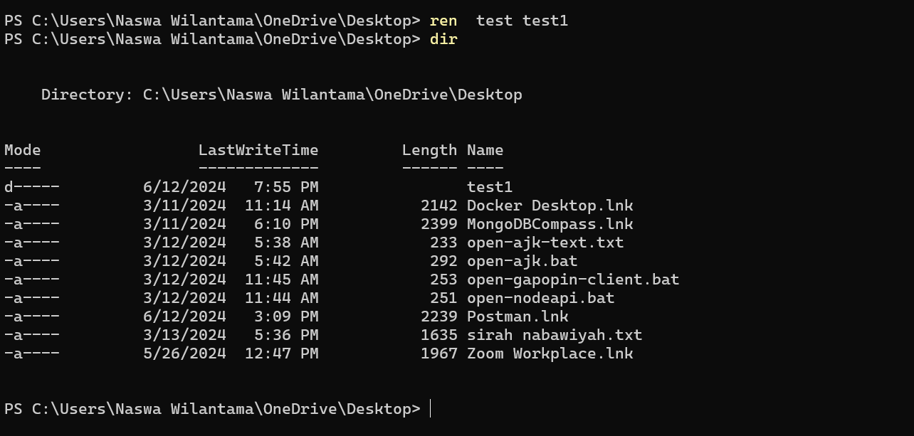
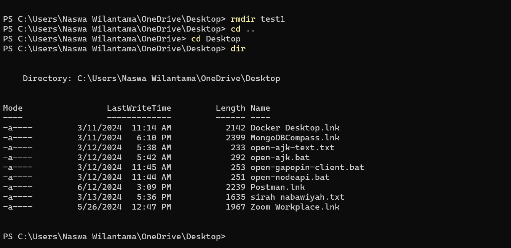

# **naswawilantama.com**

---

**_naswawilantama.com_** is a personal portfolio website, It will contain personal information, technical skills, some finished projects and contacts, built using **HTML, CSS and Javascript.**

It will consist of several pages:

1. Home
2. About
3. Projects
4. Contact

This project was designed on Figma, click the link below to look into the design.

[naswawilantama.com](https://www.figma.com/design/rIp4mfha1he0Hxnji9hrCJ/naswawilantama.com?node-id=0-1&t=ujBG9MAMByB0FfbL-1)

## **Progress Bearmentor #4**

- Day 1

1. Introduction with mentor and other mentee.

- Day 2
  1. Learning about design,
  2. UI(CLI, GUI, CLI, VUIs, AR/VR),
  3. aspects of design (color, type space, icon),
  4. steps to build design (sketch, wireframe, mockup),
  5. UI/UX,
  6. design tool [Figma](https://www.figma.com).
- Day 3
  1. Learning about variant operating systems,
  2. code editors with several types,
  3. naming conventions,
  4. markdown,
  5. how to build markdown in our projects.
- Day 4

  1. Learning about the terminal,
  2. command in terminals,
  3. step by step to using terminals with CLI,
  4. What is GIT,
  5. how to use GIT,
  6. Implementation in simple projects.

  try to do CRUD (Create, Read, Update, Delete) terminal:

  1. Create directory
     
  1. Read directory
     
  1. Go to the directory
     
  1. Rename directory
     
  1. Delete directory
     

- Day 5
  1. learning about HTML,
  2. tag-tag html,
  3. semantic element html,
  4. learning about hosting website
- Day 6
  1. learning about CSS,
  2.
